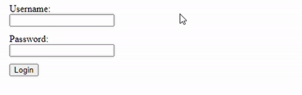

# Svelte-Dodge

Make components dodge the pointer.



## About

- Written in Svelte with Typescript
- No external 3rd party dependencies
- Easy-to-use by just wrapping any element or component
- Multiple movement modes

## Installation

```
npm i -D svelte-dodge
```

## Usage

```svelte
<script>
  import { Dodge } from 'svelte-dodge'; 
</script>

<Dodge>
  <div>
    This dodges now
  </div>
</Dodge>
```

## Props

| Prop | Default |Description|
|-----|---------------|--------------|
|activationDistance|20|Activation distance in px.|
|box|100 each|Size of possible movement area (additional to element size) in px in the directions up, down, left and right.|
|dodge|true|Toggle the movement.|
|duration|0|Transition duration in s when movement is triggered.|
|mode|'kite-flip'|See movement.|
|rate|0|Update rate on cursor position and movement trigger detection in ms. If set to 0 it uses the native browser rate.|

## Movement

Movement is triggered whenever the cursor moves inside the activation area. It is also triggered when a click happens in the activation area. Movement can be disabled with the 'dodge' flag.

| Value |Description|
|-----|--------------|
|'random'|Move to random spot im movement area when triggered. Make sure the cursor is not inside element after moving.|
|'kite'|Move away from cursor. When edge of area is reached flip to other side of area.|
|'kite-flip'|Move away from cursor. When edge of area is reached flip to other side of cursor.|


